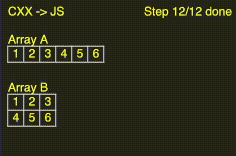
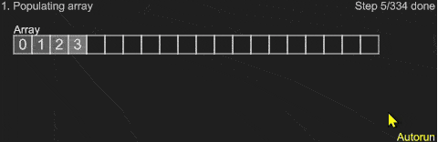

# emscripten_test

Attempting to devise a method for manufacturing data structure visualizations with the help of an LLVM pass.


## Overall organization
```plaintext
                  ┌───────────────┐                 
                  │solution.cxx   │                 
                  └───────┬───────┘                 
                          │                         
                  ┌───────▼───────┐                 
                  │solution.bc    │      ┌─────────┐
                  └───────┬───────┘      │LLVM Pass│
                          │◄─────────────┤R/W ops  │
┌───────────┐     ┌───────▼───────┐      └─────────┘
│runtime.cxx│     │instrumented.bc│                 
└─────┬─────┘     └───┬───────────┘                 
      └───────┬───────┘                             
         ┌────┼──────────────────────────────┐      
         │┌───▼────┐ ┌─────────┐ ┌──────────┐│      
         ││a.out.js│ │sketch.js│ │index.html││      
         │└────────┘ └─────────┘ └──────────┘│      
         └───────────────────────────────────┘      
```

The organization simplifies Step #2 in the following workflow:

|Before                                   |After                                   |
|-----------------------------------------|----------------------------------------|
|1. Write a leetcode solution in CXX      |1. Write a leetcode solution in CXX     |
|**2. Rewrite it in JS, generate trace**  |**2. Instrument it, log R/W ops**       |
|3. Write the correspoinding visualization|3. Write the corresponding visualization|

## Examples

1. Initializing an array

    

2. Quicksort

    

## Building and Testing

Only supports my WSL setup for now

- Build / clean

```
bash BUILD_WSL.bash         # build
bash BUILD_WSL.bash clean   # clean
```

- Test

```
npm install jest
npm test
```